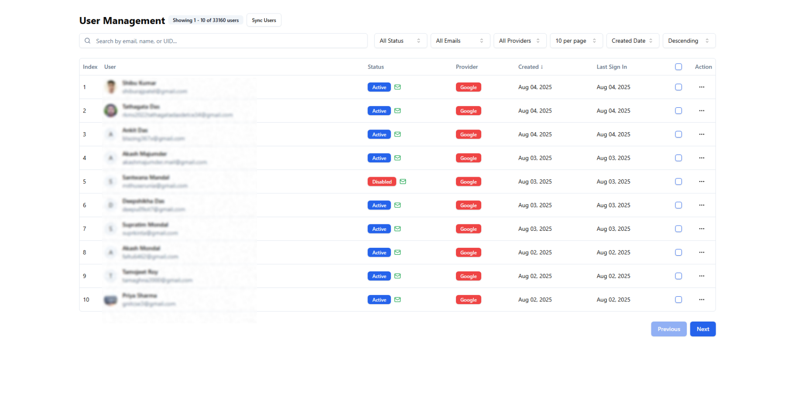

# Firebase User Management UI



This project provides a web-based user interface for managing users in a Firebase project using the Firebase Admin SDK. It allows for common user management operations such as listing, adding, editing, and deleting users.

## Why This Project?

While Firebase provides a web-based console for basic user management, this project offers a custom, extensible, and more powerful alternative for several reasons:

1.  **Enhanced Filtering and Sorting**: The Firebase console's user list has limited filtering and sorting capabilities. This project integrates a local SQLite database to cache user data, enabling advanced search, multi-criteria filtering (status, email verification, provider, date range), and flexible sorting options that are not natively available or efficient in the Firebase console.
2.  **Bulk Actions**: This UI provides robust bulk update and delete functionalities, allowing administrators to manage multiple users simultaneously, which can be cumbersome or impossible through the standard Firebase console.
3.  **Customization and Extensibility**: Being an open-source project, it can be easily customized to fit specific business needs, integrate with other internal tools, or add new features that are not part of the Firebase console's offerings.
4.  **Performance for Large User Bases**: For projects with a very large number of users, repeatedly fetching and filtering data directly from Firebase can be slow. The local SQLite cache significantly improves performance by serving queries from a local, optimized database.
5.  **Developer Control**: It provides developers with full control over the user management logic and presentation, allowing for a tailored experience that aligns with the application's overall design and operational requirements.

## Features

- List all users from Firebase Authentication.
- Add new users.
- Edit existing user details (email, display name, password, etc.).
- Delete users.
- Bulk actions for user management.
- User filtering and search.

## Technologies Used

- **Frontend**:
  - React: A JavaScript library for building user interfaces.
  - Vite: A fast build tool for modern web projects.
  - TypeScript: A superset of JavaScript that adds static typing.
  - Tailwind CSS: A utility-first CSS framework for rapidly building custom designs.
  - Shadcn UI: A collection of re-usable components built with Radix UI and Tailwind CSS.
- **Backend**:
  - Node.js: A JavaScript runtime for server-side development.
  - Express.js: A fast, unopinionated, minimalist web framework for Node.js.
  - Firebase Admin SDK: For interacting with Firebase services from a privileged environment.
- **Database**:
  - Firebase Authentication: For managing user accounts.
  - SQLite: A C library that provides a lightweight, disk-based database.

## Setup and Installation

Follow these steps to set up and run the project locally:

### 1. Clone the Repository

```bash
gh repo clone SupratimRK/UserManagementUI
cd UserManagementUI
```

### 2. Firebase Project Setup

1.  **Create a Firebase Project**: Go to the [Firebase Console](https://console.firebase.google.com/) and create a new project.
2.  **Enable Authentication**: In your Firebase project, navigate to "Authentication" and enable the desired sign-in methods (e.g., Email/Password).
3.  **Generate Service Account Key**:
    - Go to "Project settings" (the gear icon next to "Project overview").
    - Select the "Service accounts" tab.
    - Click on "Generate new private key" and then "Generate key". This will download a JSON file.
4.  **Set Environment Variable**: Copy the contents of the downloaded JSON file and set it as an environment variable named `FIREBASE_SERVICE_ACCOUNT_JSON`. For local development, create a `.env` file in the project root with:
    ```
    FIREBASE_SERVICE_ACCOUNT_JSON={"type":"service_account","project_id":"your-project-id",...}
    ```
    **Do not commit the `.env` file to version control.** Refer to `.env.example` for the structure.

### 3. Install Dependencies

Navigate to the project root and install both frontend and backend dependencies:

```bash
npm install
# or yarn install
```

### 4. Run the Development Server

To run both the frontend and backend concurrently, use the following command:

```bash
# In the project root
npm run start
# or yarn start
```

This command will:

- Start the **backend server** on `http://localhost:3001`.
- Start the **frontend development server** on `http://localhost:4001`.

Alternatively, you can run them separately:

- **Backend only**: `npm run start:backend`
- **Frontend only**: `npm run start:frontend` (or `npm run dev` which typically runs on `http://localhost:4001` by default)

## Project Structure

- `src/`: Contains the main application source code.
  - `App.tsx`: Main React component.
  - `main.tsx`: Entry point for the React application.
  - `index.css`: Global CSS styles (Tailwind CSS).
  - `backend/`: Node.js/Express backend for Firebase Admin SDK interactions.
    - `index.cjs` / `index.js`: Backend server entry point.
  - `components/`: React components.
    - `ui/`: Shadcn UI components.
    - `UserManagement/`: Components specific to user management features.
  - `hooks/`: Custom React hooks.
  - `lib/`: Utility functions and Firebase initialization.
    - `firebase.ts`: Firebase Admin SDK initialization.
    - `utils.ts`: General utility functions.
  - `types/`: TypeScript type definitions.
- `serviceAccountKey.json`: Your Firebase service account key (ignored by Git).
- `serviceAccountKey.json.EXAMPLE.md`: Example and instructions for the service account key.
- `users.db`: The SQLite database file used for caching Firebase user data. (This file is generated at runtime and should not be committed to version control).
- `package.json`: Project dependencies and scripts.
- `vite.config.ts`: Vite frontend configuration.
- `tailwind.config.js`, `postcss.config.js`: Tailwind CSS configuration.
- `tsconfig.json`: TypeScript configuration.

## How It Works

This project employs a robust client-server architecture designed for security, performance, and maintainability:

1.  **Frontend (React/Vite)**: The user interface, built with React and bundled by Vite, provides an intuitive way to manage Firebase users. It communicates with the backend API to initiate all user management operations.
2.  **Backend (Node.js/Express)**: A Node.js/Express server serves as a secure intermediary between the frontend and Firebase.
    - **Firebase Admin SDK Integration**: It initializes the Firebase Admin SDK using the `serviceAccountKey.json`, enabling privileged operations like listing, creating, updating, and deleting users.
    - **Local Data Cache (SQLite)**: To enhance performance and enable advanced filtering/pagination capabilities not directly available or efficient with Firebase's `listUsers` API, the backend maintains a local cache of user data in a SQLite database (`users.db`).
    - **User Synchronization**: An endpoint (`/sync-users`) is provided to synchronize user data from Firebase Authentication into the local SQLite database. This ensures the UI always displays up-to-date information while benefiting from the local database's query capabilities.
    - **API Endpoints**: The backend exposes RESTful API endpoints for the frontend to interact with, abstracting the underlying Firebase and SQLite operations.
3.  **Firebase Authentication**: This is the authoritative source for user accounts. The backend interacts with Firebase Authentication via the Admin SDK to perform the actual user management.
4.  **SQLite Database (`users.db`)**: This local database acts as a performant cache for Firebase user data, facilitating efficient search, filtering, sorting, and pagination directly on the backend without repeatedly querying Firebase for large user lists.

## Why This Architecture?

The decision to implement a separate Node.js/Express backend with a local SQLite cache is driven by several key considerations:

1.  **Security**: The Firebase Admin SDK grants full administrative privileges to your Firebase project. Exposing this SDK directly to a client-side application would be a severe security vulnerability, allowing unauthorized access and manipulation of your Firebase data. By running the Admin SDK on a secure backend server, sensitive operations are protected from client-side exposure.
2.  **Performance and Scalability**:
    - Firebase's `listUsers` API is designed for administrative tasks and can be inefficient for real-time, interactive filtering, sorting, and pagination of large user bases directly from the client.
    - The local SQLite database acts as a high-performance cache. Once users are synced, the frontend's queries for filtering, searching, and pagination are served rapidly from the local database, significantly improving UI responsiveness and reducing the load on Firebase.
3.  **Enhanced Query Capabilities**: SQLite provides powerful SQL querying capabilities that allow for complex filtering, sorting, and searching (e.g., case-insensitive search across multiple fields, date range filtering) that would be cumbersome or impossible to implement efficiently directly with the Firebase Admin SDK's `listUsers` method alone.
4.  **Abstraction and Flexibility**: This architecture decouples the frontend from the specific implementation details of Firebase. If, in the future, there's a need to integrate with another authentication system or a different database, the changes would primarily be confined to the backend, minimizing impact on the frontend.

## Usage

Once the application is running, navigate to `http://localhost:4001` (or the port specified by Vite). You can then use the UI to:

- View a list of your Firebase users.
- Add new users by providing their email, password, and optional display name.
- Select a user from the table to edit their details.
- Delete individual users or perform bulk deletions.

### Filtering and Sorting

The UI provides comprehensive filtering and sorting capabilities to efficiently manage your user base:

- **Search**: Use the search bar to find users by their email, display name, or User ID (UID).
- **Status Filter**: Filter users by their account status: `Enabled` or `Disabled`.
- **Email Verification Filter**: Filter users based on whether their email address is `Verified` or `Unverified`.
- **Authentication Provider Filter**: Select a specific authentication provider (e.g., `password`, `google.com`, `github.com`) to view users who signed up using that method.
- **Date Range Filter**: Filter users by their account creation time within a specified date range (from and to dates).
- **Sorting**: Sort the user list by `Creation Time` or other relevant fields in ascending or descending order.

These filters are applied on the backend, leveraging the SQLite cache for fast and efficient data retrieval.

## Automated User Management

The project includes automated scripts for periodic user synchronization and security management:

### Sync and Auto-Disable Suspicious Users

- **Script**: `sync-and-disable.cjs`
- **Purpose**: Synchronizes all users from Firebase Auth to the local SQLite cache, identifies suspicious users (those with identical display names and creation dates), and automatically disables any suspicious users that are not already disabled.
- **Automation**: Runs automatically via GitHub Actions at 3:00 AM IST daily
- **Usage**:
  - Local: `npm run sync-and-disable`
  - Manual trigger: Go to GitHub Actions tab and run the workflow manually

### Setting Up GitHub Actions Automation

1. **Create GitHub Secret**:
   - Go to your GitHub repository settings
   - Navigate to "Secrets and variables" > "Actions"
   - Click "New repository secret"
   - Name: `FIREBASE_SERVICE_ACCOUNT_JSON`
   - Value: Copy the entire JSON string from your `.env` file (the value of `FIREBASE_SERVICE_ACCOUNT_JSON`)

2. **The workflow** (`.github/workflows/sync-users.yml`) will:
   - Run automatically every day at 3:00 AM IST
   - Checkout your code
   - Install dependencies
   - Run the sync and auto-disable script
   - You can also trigger it manually from the Actions tab

This automation helps maintain user security by regularly identifying and disabling potentially suspicious accounts.

## Contributing

Contributions are welcome! Please feel free to open issues or submit pull requests.

## License

[MIT License](LICENSE) (This project is licensed under the MIT License, allowing for free use, modification, and distribution. See the LICENSE file for more details.)
